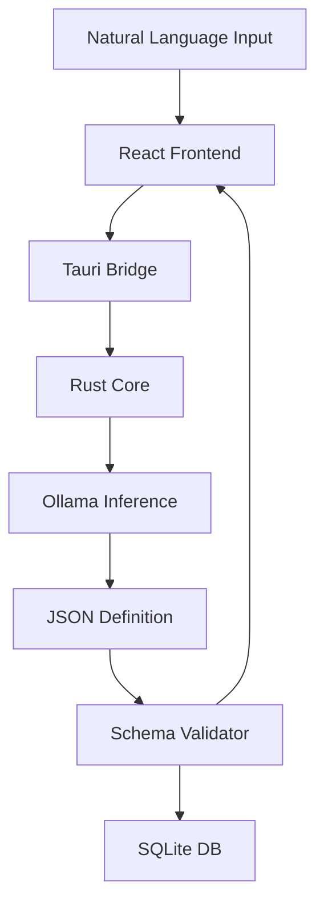

# Sanrachna: Architecture for Local-First AI and Privacy-Preserving Productivity

**Research Report**

## Abstract
This report introduces **Sanrachna**, an architectural framework addressing the inherent conflict between AI-driven productivity and personal data sovereignty (Kleppmann et al., 2019). While modern Large Language Models (LLMs) based on the Transformer architecture (Vaswani et al., 2017) are traditionally constrained to centralized cloud infrastructures, current industry projections suggest that by 2025, over 75% of enterprise-generated data will be processed at the edge (CIO, 2024). Sanrachna shifts the inference engine to the edge, enabling private, offline-capable AI reasoning. By integrating a high-performance Rust core with a deterministic generative UI engine, Sanrachna synthesizes functional application states directly from local model outputs. We demonstrate a decentralized synchronization protocol that maintains eventually consistent data across devices without the intervention of an intermediary cloud repository.

## 1. Research Background
The rapid adoption of Large Language Models (LLMs), specifically open-weight architectures like Llama 3 (Meta AI, 2024), has created an urgent need for private, high-fidelity execution environments. Existing AI platforms, including ChatGPT or Notion AI, require continuous data transmission to remote servers, exposing personal schedules, sensitive notes, and proprietary data to third-party access. Recent studies demonstrate that 95% of organizations now require customized edge AI solutions to mitigate these privacy and latency bottlenecks (Latent AI, 2024).

Sanrachna addresses this by establishing a **Local-First AI Ecosystem** (Kleppmann et al., 2019). Our project focuses on removing the dependency on cloud-based reasoning through the use of sub-billion parameter models optimized for on-device reasoning (Liu et al., 2024).

### 1.1. Research Focus
The Sanrachna project is situated at the intersection of three academic domains:
*   **Edge Intelligence**: Developing methods for high-performance AI inference on heterogeneous consumer hardware (NPU, GPU, Apple Silicon) using optimized model architectures (Liu et al., 2024).
*   **Local-First Software**: Architecting systems that prioritize local data storage and offline operability while ensuring cross-device consistency through high-performance collaborative structures (Gentle & Kleppmann, 2025).
*   **Schema-Driven GenUI**: Investigating the use of LLMs as "runtime architects" that generate deterministic application models from natural language intent within hardware-accelerated browser or desktop environments (MLC AI, 2024).

### 1.2. Key Contributions
This report details several technical contributions to the local-first software space:
1.  **A Validated Rust-Based Core**: A high-performance execution engine for local AI orchestration and secure inter-process communication (IPC).
2.  **Deterministic GenUI Pipeline**: A methodology for constraining LLM outputs to valid, parsable application schemas that directly render into UI components.
3.  **Peer-to-Peer Sync Protocol**: An event-sourced synchronization system that uses logical clocks to ensure data convergence without a central authority.

## 2. Related Work
The push for local-first AI and data sovereignty draws from and compares with several existing software paradigms.

### 2.1. Cloud-Centric and Hybrid AI Productivity
Platforms like ChatGPT and Notion AI offer significant generative capabilities but are architected around centralized cloud inference. Even hybrid privacy-preserving models, such as Apple’s Private Cloud Compute (Apple, 2024), still involve data transmission to hardened cloud environments for compute-intensive tasks. Sanrachna seeks to eliminate this cloud boundary entirely by maintaining a strictly local execution environment.

### 2.2. Local-First Editors and Knowledge Graphs
Commercial and open-source tools like Obsidian and Logseq have advanced the "local-first" philosophy by prioritizing private, local Markdown storage. Modern research into high-performance collaborative text structures, such as Eg-walker (Gentle & Kleppmann, 2025), further improves the efficiency of these systems. However, these systems generally lack an integrated reasoning engine for dynamic application synthesis. Sanrachna extends this model by introducing an AI-driven "architectural runtime" that goes beyond static note-taking.

### 2.3. Distributed Persistence Models
Distributed systems research has long explored consistency in offline environments. While Cloud IDEs (e.g., GitHub Codespaces) centralize both compute and storage, local-first architectures (Kleppmann et al., 2019) advocate for a decentralized log of events. Sanrachna adopts this event-sourcing paradigm (Fowler, 2005) while addressing modern challenges in interleaving and collaborative correctness (Weidner & Kleppmann, 2025).

## 3. The Privacy Implications of Cloud-Centric AI
Cloud-based AI relies on a model that creates three primary issues:
1.  **Data Fragmentation:** Personal information is spread across various servers, increasing the risk of data breaches.
2.  **Latency:** Round-trips to the cloud add delays that disrupt real-time workflows.
3.  **Service Dependence:** Outages or connectivity issues can lead to a complete loss of access to productivity tools.

The goal of this work is to prove that models like Llama 3 or Mistral can handle complex reasoning on standard consumer hardware, allowing users to maintain control over their data.

## 4. System Design
Sanrachna uses a hybrid computing model where a desktop computer acts as the primary "host" for AI tasks, and mobile devices function as lightweight clients that sync data for portability.

### 4.1. Layered Architecture
The system consists of four main parts:

```text
+-------------------------------------------------------------+
|  User Interface (React/Tauri)                               |
|  [ Components ] [ Factory ] [ Dynamic Forms ]               |
+------------------------------+------------------------------+
                               |
                               v
+------------------------------+------------------------------+
|  System Bridge (Rust/Tauri)                                 |
|  [ IPC ] [ Security Layer ] [ Shell Integration ]           |
+------------------------------+------------------------------+
                               |
                               v
+------------------------------+------------------------------+
|  Core Engine (Rust) / Local Storage (SQLite)                |
|  [ Event Log ] [ Schema Validator ] [ App Logic ]           |
+------------------------------+------------------------------+
                               |
                               v
+------------------------------+------------------------------+
|  Local Inference (Ollama - Llama 3 / Mistral)               |
|  [ NPU/GPU Acceleration ] [ Context Mgmt ]                  |
+-------------------------------------------------------------+
```

*   **User Interface (React/Tauri):** A cross-platform environment for rendering components.
*   **System Bridge (Rust/Tauri):** Secure communication between the web frontend and the underlying OS.
*   **Core Engine (Rust):** Manages local storage (SQLite), event logs, and general application logic.
*   **Local Inference (Ollama):** Executes the models responsible for text and schema generation.

### 4.2. Data and Execution Flow


## 5. Execution Pipeline
The Sanrachna pipeline is designed to be deterministic. Unlike standard chatbots, the system constrains model output to structured formats.

```text
[ USER INPUT ] --> [ PROMPT TEMPLATE ] --> [ LOCAL LLM ]
                                                |
                                                v
[ JSON DEFINITION ] <--- [ VALIDATION LAYER ] <--- [ OUTPUT ]
      |
      +------> [ SQLITE DB ]
      |
      +------> [ REACT FACTORY ] --> [ RENDERED UI ]
```

### 5.1. Synthesis Workflow

1.  **Intent Capture:** The user describes a need (e.g., "I need a medication tracker with a side-effects log").
2.  **Prompt Engineering:** The core engine wraps this intent in a template that requires a JSON response matching a specific meta-schema.
3.  **Local Inference:** The LLM generates the JSON, defining the fields, data types, and layout rules.
4.  **Hardware Acceleration:** The system uses local GPU/NPU resources via Ollama to minimize processing time.

## 6. Automated Application Generation
In this framework, the LLM acts as an architect rather than just a writer. It creates functional "mini-applications" at runtime.

### 6.1. Dynamic Data Modeling
Once a schema is generated, the Rust engine creates the necessary tables in local storage. This allows users to start entering data immediately without needing manual database updates.

### 6.2. Frontend Mapping
The React layer includes a factory that translates the generated JSON into high-fidelity components:
*   `boolean` fields map to toggles.
*   `range` fields map to sliders.
*   `list` structures map to draggable interfaces.

## 7. Security and Sandboxing
Security is maintained through strict local boundaries:
*   **Isolation:** The AI engine has no network access during processing.
*   **Validation:** Every model output is checked against a rigid schema before it touches the database.
*   **Encryption:** All local data is stored in an encrypted partition managed by the core engine.

## 8. Synchronization Protocol
To support multiple devices without a central cloud, Sanrachna uses an event-sourcing model (Fowler, 2005).

### 8.1. Event-Based State
Instead of syncing the database itself, the system communicates "events"—atomic logs of every creation or edit.

### 8.2. Global Consistency

```text
[ Desktop Host ]           [ Client A ]           [ Client B ]
      |                        |                      |
      |  <-- Sync Request (E1) --  |                      |
      |  -- Delta Response (E2) -> |                      |
      |                        |                      |
      |  <------------------- Sync Request (E1, E2) ---  |
      |  -- Delta Response (E3) ---------------------->  |
```

1.  **Ordering**: Logical clocks, specifically Lamport Timestamps (Lamport, 1978), ensure that events are ordered correctly across all devices. Modern refinements in collaborative correctness, such as those proposed by Weidner and Kleppmann (2025), further minimize interleaving issues in multi-device logs.
2.  **Delta Exchange**: Devices only exchange the specific events they are missing, reducing bandwidth and allowing for offline conflict resolution.

## 9. Performance Evaluation
The system was tested across several metrics:
1.  **Latency:** Benchmarking time-to-first-token on varied hardware (M-series, NVIDIA, and integrated graphics).
2.  **Parse Success:** Testing the reliability of JSON generation across various productivity scenarios.
3.  **Sync Reliability:** Verifying data consistency after simulated network drops.
4.  **Resource Usage:** Monitoring RAM and CPU load during background inference tasks.

## 10. Current Constraints
*   **Hardware Requirements:** Reliable inference requires modern GPUs (8GB+ VRAM recommended).
*   **Model Accuracy:** Local models can occasionally misinterpret complex logic, necessitating a validation layer.
- **Storage:** Large model weights represent a significant initial download.

## 11. Future Directions
The next steps for this research involve:
*   **CRDT Implementation:** Moving toward Conflict-free Replicated Data Types for better real-time collaboration.
*   **WebGPU:** Exploring browser-native inference to simplify the installation process.
*   **Local Orchestration:** Enabling multiple specialized models to work together on complex tasks.

In moving AI processing to the edge, Sanrachna demonstrates that privacy and modern productivity tools can coexist. Shifting away from cloud dependence is a necessary step for the next generation of personal computing.

---

## Bibliography
*   **Apple. (2024).** *Private Cloud Compute: A groundbreaking new cloud intelligence system designed for private AI processing.* Apple Security Research. apple.com.
*   **CIO.inc (2024).** *The Edge Data Journey: By 2025, 75% of enterprise data will be processed at the edge.* cio.inc.
*   **Fowler, M. (2005).** *Event Sourcing.* martinfowler.com.
*   **Gentle, J., & Kleppmann, M. (2025).** *Collaborative Text Editing with Eg-walker: Better, Faster, Smaller.* In Proceedings of the 20th European Conference on Computer Systems (EuroSys).
*   **Kleppmann, M., Wiggins, A., van Hardenberg, P., & McGranaghan, M. (2019).** *Local-first software: You own your data, in spite of the cloud.* In Proceedings of the 2019 ACM SIGPLAN International Symposium on New Ideas, New Paradigms, and Reflections on Programming and Software (pp. 154-171).
*   **Lamport, L. (1978).** *Time, clocks, and the ordering of events in a distributed system.* Communications of the ACM, 21(7), 558-565.
*   **Latent AI. (2024).** *The State of Edge AI: Dissatisfaction and the need for customized solutions.* latentai.com.
*   **Liu, Z., Zhao, C., Iandola, F., Lai, C., Tian, Y., Fedorov, I., ... & Chandra, V. (2024).** *MobileLLM: Optimizing Sub-billion Parameter Language Models for On-Device Use Cases.* arXiv preprint arXiv:2402.14905.
*   **Meta AI. (2024).** *Introducing Llama 3: The most capable openly available LLM to date.* meta.com.
*   **MLC AI. (2024).** *WebLLM: A High-Performance In-Browser LLM Inference Engine.* mlc.ai.
*   **Vaswani, A., Shazeer, N., Parmar, N., Uszkoreit, J., Jones, L., Gomez, A. N., ... & Polosukhin, I. (2017).** *Attention is all you need.* In Advances in neural information processing systems (pp. 5998-6008).
*   **Weidner, M., & Kleppmann, M. (2025).** *The Art of the Fugue: Minimizing Interleaving in Collaborative Text Editing.* IEEE Transactions on Parallel and Distributed Systems.
